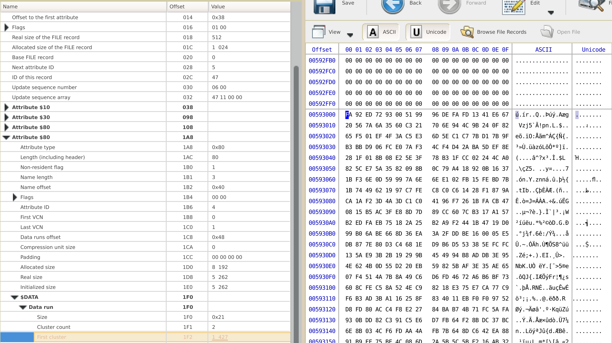

# Bad Memory

## Описание

> Amnesia is no joke: not only did Johan hide his secret file somewhere on the remote file system - and did it in a very obscure manner - but also forgot why, where, and how he did it.
> In his home directory you will find bad.img, which is the image file of that remote file system where Johan buried his treasures but unluckily lost the exact route leading to his secrets. 
> Help him recover his secrets! Note: some signatures may be partially broken.
> 
> Hint #1: Hidden archive has been split into two parts. Both can be found by analyzing the file system structure. Also some plaintext parts inside this image refer to the hiding techniques used in the task.  
> Hint #2: Find the mentioned paper, keep the task title in mind, use one of the techniques. As for 2nd part, it should probably be already found :)

## Решение

В качестве входных данных для этого задания нам даётся [img-файл](badMemory.img), содержащий образ NTFS-системы. Из описания задания ясно, что необходимо восстановить какие-то данные.

Смонтировав img-файл, можно увидеть, что в этом образе есть несколько директорий с текстовыми файлами, а также readme.txt со следующим содержимым:

> Password for the lost archive should be 5up3r5eCURE!  
> Also check out the "Data hiding in the NTFS file system" paper, it's pretty cool

Отсюда делаем следующие выводы: 

1. Мы ищем архив (держим в уме то, что сигнатуры могут быть частично битыми, так что просто его найти не удастся). По этой причине лучше заранее скопировать на видное место список сигнатур основных расширений архивов (zip, rar, ...). 
2. Для решения задания потребуется ознакомиться со статьей "Data hiding in the NTFS file system".

Изучая статью, замечаем практически в самом начале пункт "Hiding data in $BadClus file". Там описывается способ сокрытия данных в фейковых плохих кластерах: плохие кластеры добавляются в атрибут $Bad файла $BadClus, а также изменяется $Bitmap, чтобы кластер был помечен как "используемый" и не перезатирался. Для того, чтобы увидеть смещение до плохого кластера, воспользуемся утилитой Active@ Disk Editor.

Атрибут $Bad – это второй атрибут $80 ([см. здесь](https://flatcap.org/linux-ntfs/ntfs/files/badclus.html)). Раскрыв список $DATA, видим два data run’a, один из них (с пометкой sparse) имеет размер, равный размеру всего образа, и присутствует в $BadClus по умолчанию. Второй же нам более интересен: он содержит 1 кластер и описывает предполагаемый плохой кластер. Переходим по ссылке на единственный кластер и видим такую картину:

Видим 4 кБ непонятных бинарных данных. Если приглядеться к первым 8 байтам и сравнить их с нашим списком сингатур, можно заметить, что это напоминает сигнатуру RAR-файла с измененными первыми 2 байтами. Извлекаем кластер на диск и меняем FF FF на 52 61. Однако сейчас открыть архив не получится, мы нашли не все части.

Найти вторую часть значительно проще, она скрыта с использованием классического для файловой системы NTFS метода. Впрочем, даже не имея опыта работы с NTFS, можно прочитать текстовые файлы из образа и наткнуться на главу "Alternate Data Streams (ADS)" - в альтернативных потоках файлов можно также скрывать данные. Чтобы найти ADS, мы воспользуемся Active@ Disk Editor. У файла readme.txt находим несколько атрибутов с $DATA, один из которых соответствует ADS.

Более простым способом нахождения нужного файла будет использование, например, команды "attr" в Linux:

Изменив первые два байта в первой части архива и склеив обе части в один файл, используем пароль из readme.txt для разархивирования содержимого. Там видим файл с флагом.

Решение: см. [скрипт](zn_bad_memory_solver.sh).
