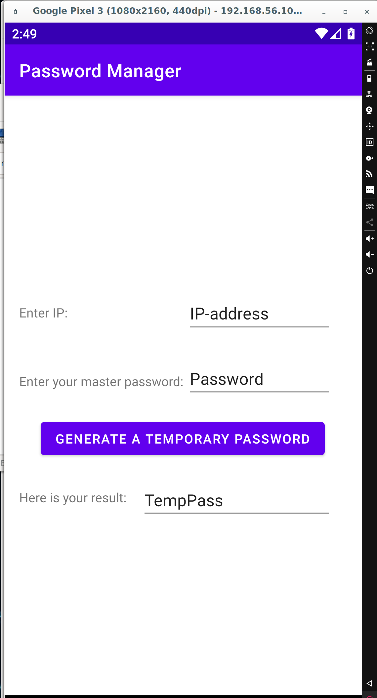
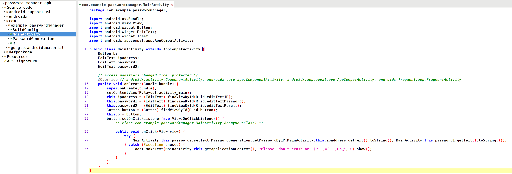

# Password manager

## Описание

> "Very Modern Developers Inc." has developed its own password manager so its employees won't need to keep in mind all the unique passwords they use. 
> Funnily enough, they claim it to be "probably the most secure, random, robust, crypto strong password manager of all times you, losers, will never break", as the CTO puts it (direct quote, yes). 
> Unfortunately for them, we managed to obtain access to its APK and some files of their employee Alice. Can you break it for us?  
> After you get the flag, use another one of your findings to access SSH: ssh -p40122 alice@37.18.73.124 
> 
> Hint #1: Alice may have re-used the same key for different IPs. Try restoring the original key aka "master password"

## Решение

Нам дано сразу 4 файла:

1. Файл [128.129.130.131.txt](128.129.130.131.txt) с непонятной строкой.
2. Зашифрованный архив [flag.zip](flag.zip) (strings подсказывают нам, что там есть два файла – flag.txt и alice_password.txt, но посмотреть их сейчас не удастся).
3. Файл [note.txt](note.txt) со следующим содержимым:

> Password used to the encrypt the archive is for 127.0.0.1

4. Пакет мобильного приложения для Android [password_manager.apk](password_manager.apk)

Открыв apk-файл в эмуляторе, видим следующую картину.

Данное приложение позволяет сгенерировать "временный пароль" на основе IP-адреса и некоторого мастер-пароля. Можно предположить, что первый файл с IP-адресом в названии как раз содержит сгенерированный временный пароль на основе этого адреса и некоторого неизвестного мастер-пароля.

Ознакомившись с этими файлами, можно составить следующий план действий для решения таска:

1. Как видно из файла note.txt, пароль к архиву с флагом можно получить, сгенерировав временный пароль для 127.0.0.1. Проблема в том, что мастер-пароль нам не известен.
2. Если предположить факт повторного использования мастер-пароля (о чем и говорится в подсказке), можно попытаться извлечь мастер-пароль из известной нам пары текст/шифртекст (файл 128.129.130.131.txt) и попытаться использовать его для генерации пароля к архиву.
3. Чтобы понять, возможно ли это и, если да, то как, необходимо разреверсить файл apk и изучить процесс генерации пароля.

Воспользуемся jadx-gui для декомпиляции apk:

Видим в приложении несколько классов, в частности MainActivity и PasswordGeneration. В MainActivity можно заметить, что поле для временного пароля заполняется на основе вызова функции PasswordGeneration.getPasswordByIP, в которую передаются строковые IP-адрес и мастер-пароль. Больше в этом классе ничего интересного нет.  
Рассмотрим теперь функцию getPasswordByIP из соседнего класса:

	public static String getPasswordByIP(String str, String str2) {
		return decode(xor(convertIP(str), convertPassword(str2)));
	}

Здесь вызываются сразу несколько функций: сначала конвертируются IP и мастер-пароль с помощью соответствующих функций, затем XOR'ятся, после чего результат декодируется. Функция xor ничем не примечательна, реализует обычный XOR двух бинарных строк (обрезая длинную строку); decode – преобразование бинарной строки в символьную. Более подробно рассмотрим функции convert:

	private static String prepare(String str, String str2) {
		String str3 = "";
		for (int i = 0; i < str.length(); i++) {
			if (i % 6 == 0) {
				str3 = str3 + str2;
			}
		str3 = str3 + str.charAt(i);
		}
		while (str3.length() % 8 != 0) {
			str3 = str3 + "0";
		}
		return str3;
	}
	
	private static String convertIP(String str) {
		String[] split = str.split("\\.");
		String str2 = "";
		for (String str3 : split) {
			str2 = str2 + String.format("%8s", Integer.toBinaryString(Integer.parseInt(str3))).replaceAll(" ", "0");
		}
		return prepare(str2 + str2, "01");
	}
	
	private static String convertPassword(String str) {
		String str2 = "";
		for (int i = 0; i < str.length(); i++) {
			str2 = str2 + String.format("%8s", Integer.toBinaryString(str.charAt(i))).replaceAll(" ", "0");
		}
		return prepare(str2, "00");
	}

Проанализируем эти функции:

- convertIP генерирует из IP-адреса бинарную строку: каждый октет преобразуется в 8-символьную бинарную строку, после чего склеивается с остальными, разделители "." отбрасываются. Получившаяся строка склеивается сама с собой и передается в функцию prepare, второй аргумент – "01".
- convertPassword посимвольно переводит пароль в бинарный вид (8 бит на символ) и передает результат в prepare с аргументом "00".
- prepare разбивает бинарную строку на группы по 6 символов, между ними вставляет разделитель – второй аргумент (то есть "01" для IP-адреса и "00" для пароля), после чего дополняет полученную строку нулями до длины, кратной 8.

Весь рассмотренный метод генерации пароля таким образом является лишь немного усложненной версией XOR'а бинарных представлений IP-адреса и мастер-пароля с учетом удвоений строк и разделителей. Это означает, что из пары текст/шифртекст, которая у нас имеется, можно восстановить мастер-пароль.  
Особое внимание следует обратить на то, что после XOR'а мы получаем мастер-пароль с разделителями, которые нам не нужны. Также нет никакой гарантии, что мы восстановим мастер-пароль в его изначальном виде, поскольку функция xor обрезает наиболее длинную из строк – последние байты пароля могут отличаться. Тем не менее, это не помешает нам воспользоваться им для генерации правильного пароля к архиву. Пример скрипта для восстановления мастер-пароля – [solver.py](solver.py).

Восстановив мастер-пароль, генерируем с его помощью пароль для архива и получаем флаг, а также пароль Алисы для SSH.
